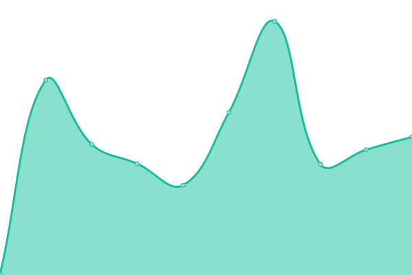

# [📈 Live Status](https://FriendlyUser.github.io/uptime-check): <!--live status--> **🟧 Partial outage**

This repository contains the open-source uptime monitor and status page for [David Li](https://friendlyuser.github.io), powered by [Upptime](https://github.com/upptime/upptime).

With [Upptime](https://upptime.js.org), you can get your own unlimited and free uptime monitor and status page, powered entirely by a GitHub repository. We use [Issues](https://github.com/FriendlyUser/uptime-check/issues) as incident reports, [Actions](https://github.com/FriendlyUser/uptime-check/actions) as uptime monitors, and [Pages](https://FriendlyUser.github.io/uptime-check) for the status page.

<!--start: status pages-->
<!-- This summary is generated by Upptime (https://github.com/upptime/upptime) -->
<!-- Do not edit this manually, your changes will be overwritten -->

| URL                                                               | Status  | History                                                                                                                                          | Response Time                                                                                         | Uptime                                                                                                                                                                                                                                                                               |
| ----------------------------------------------------------------- | ------- | ------------------------------------------------------------------------------------------------------------------------------------------------ | ----------------------------------------------------------------------------------------------------- | ------------------------------------------------------------------------------------------------------------------------------------------------------------------------------------------------------------------------------------------------------------------------------------ |
| [Google](https://www.google.com)                                  | 🟩 Up   | [google.yml](https://github.com/FriendlyUser/uptime-check/commits/master/history/google.yml)                                                     |  53ms                            |                                                      |
| [Broken Site](https://thissitedoesnotexist.com)                   | 🟥 Down | [broken-site.yml](https://github.com/FriendlyUser/uptime-check/commits/master/history/broken-site.yml)                                           |  0ms                        |                                            |
| [Ceo](https://ceo.ca)                                             | 🟩 Up   | [ceo.yml](https://github.com/FriendlyUser/uptime-check/commits/master/history/ceo.yml)                                                           |  253ms                              |                                                            |
| [TradingView](https://www.tradingview.com/)                       | 🟩 Up   | [trading-view.yml](https://github.com/FriendlyUser/uptime-check/commits/master/history/trading-view.yml)                                         |  607ms                     |                                          |
| [Check if the shop site goes down.](https://shop.syomortgage.com) | 🟩 Up   | [check-if-the-shop-site-goes-down.yml](https://github.com/FriendlyUser/uptime-check/commits/master/history/check-if-the-shop-site-goes-down.yml) |  407ms |  |

<!--end: status pages-->

[**Visit our status website →**](https://FriendlyUser.github.io/uptime-check)

## 📄 License

- Code: [MIT](./LICENSE) © [David Li](https://friendlyuser.github.io)
- Data in the `./history` directory: [Open Database License](https://opendatacommons.org/licenses/odbl/1-0/)
